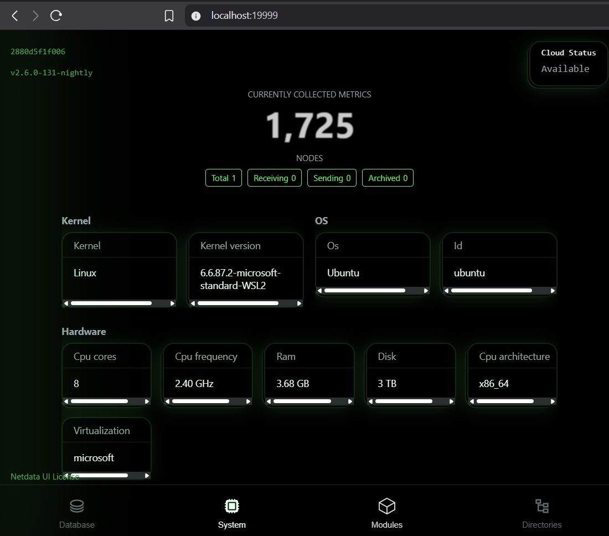

Absolutely! Based on your successful setup, log exploration, and container monitoring via Netdata, here’s a **professionally structured `README.md`** tailored for your **DevOps Task 7: Netdata Monitoring**.

---

````markdown
# 📊 Netdata System Monitoring – DevOps Task 7

---

## 📌 Overview

This project showcases the deployment of **Netdata**, a powerful and lightweight real-time monitoring tool, using **Docker** inside a **WSL2 Ubuntu environment**. With a live dashboard running at `http://localhost:19999`, Netdata gives full visibility into system and container performance metrics like:

- CPU, memory, disk I/O, and network activity
- Running services and processes
- Docker container metrics
- System health and performance KPIs

---

## 🛠️ Tech Stack

| Tool/Platform     | Purpose                                      |
|-------------------|----------------------------------------------|
| Netdata           | Real-time system and app monitoring          |
| Docker            | Containerized deployment                     |
| WSL2 + Ubuntu 24.04| Linux environment inside Windows             |
| GitHub            | Documentation and task submission            |

---

## ⚙️ How It Works

1. **Docker Pull & Run**  
   Runs the latest Netdata image with necessary host bindings for system-level metrics.

2. **Web Dashboard Access**  
   Real-time metrics available instantly at `http://localhost:19999`

3. **Data Volume Mapping**  
   Volumes used to persist logs, configs, and performance data across container restarts.

---

## 🧰 Setup Instructions

### ✅ Run Netdata in Docker

```bash
docker run -d --name=netdata \
  -p 19999:19999 \
  -v netdataconfig:/etc/netdata \
  -v netdatalib:/var/lib/netdata \
  -v netdatacache:/var/cache/netdata \
  -v /etc/passwd:/host/etc/passwd:ro \
  -v /etc/group:/host/etc/group:ro \
  -v /proc:/host/proc:ro \
  -v /sys:/host/sys:ro \
  -v /etc/os-release:/host/etc/os-release:ro \
  --cap-add SYS_PTRACE \
  --security-opt apparmor=unconfined \
  netdata/netdata
````

> ⏳ This will automatically pull the image if it's not found locally.

---

## 🌐 Access Dashboard

Visit:
👉 [http://localhost:19999](http://localhost:19999)

> A web-based dashboard with live updating charts will appear.

---

## 📁 Project Structure

```
Netdata_Monitoring_DevopsTask7/
├── README.md                # Documentation and answers
├── netdata-dashboard.png    # Screenshot of Netdata web UI
```

---

## 🧪 Sample Metrics Observed

| Metric Category | Key Insights Observed                    |
| --------------- | ---------------------------------------- |
| CPU             | Per-core usage, system load, irq/softirq |
| Memory          | RAM usage, page faults, cache hits       |
| Disk I/O        | Read/write rates, IOPS, latency          |
| Network         | Bandwidth, packet drops, errors          |
| Docker          | Container CPU, memory, and disk stats    |
| Processes       | Top resource-consuming processes         |

---

## 📂 Logs & Config Paths

| Location             | Purpose                           |
| -------------------- | --------------------------------- |
| `/var/log/netdata`   | Logs (symlinked to stdout/stderr) |
| `/etc/netdata`       | Configuration files               |
| `/var/lib/netdata`   | Persistent metric database        |
| `/var/cache/netdata` | Ephemeral runtime data            |

Inside the container:

```bash
docker exec -it netdata bash
cd /var/log/netdata
```

> View logs like `access.log`, `error.log`, `health.log` to troubleshoot or analyze performance.

---

## ❓ Interview Questions – With Answers

| Question                                         | Answer                                                                                                                           |
| ------------------------------------------------ | -------------------------------------------------------------------------------------------------------------------------------- |
| **1. What does Netdata monitor?**                | System metrics (CPU, memory, disk, network), Docker containers, processes, and more in real time.                                |
| **2. How do you view real-time metrics?**        | Through a web interface at `http://localhost:19999` updated every second.                                                        |
| **3. What is a collector?**                      | Collectors are Netdata plugins that gather data from the system, containers, or apps.                                            |
| **4. How is Netdata different from Prometheus?** | Netdata focuses on live visualizations and instant troubleshooting. Prometheus is better for historical metrics and alert rules. |
| **5. Key performance KPIs to monitor?**          | - CPU & Memory Usage<br> - Load Average<br> - Disk Latency<br> - Docker Container Health<br> - Network Throughput                |
| **6. How to deploy Netdata on a VM?**            | Use Docker as shown or run the install script: `bash <(curl -Ss https://my-netdata.io/kickstart.sh)`                             |
| **7. How does Netdata alerting work?**           | Netdata has built-in thresholds and sends alerts via email, Slack, Discord, etc. via its health engine.                          |
| **8. What is a dashboard in this context?**      | A web-based, real-time GUI that shows system metrics grouped into interactive charts.                                            |

---

## 🧠 What I Learned

* Deploying containerized observability tools
* Using Docker volumes for persistent metrics and logs
* Navigating system monitoring dashboards and logs
* Differences between real-time and historical monitoring
* Netdata’s architecture and plugin system

---

## 📸 Screenshot

> 🖼️ Netdata Dashboard



---

## ✅ Completed By: [Anagha](https://github.com/Anagha-07)

````

---

## ✅ 3. GitHub SSH Push (Quick Recap)

### Step-by-step to push your task repo using SSH:

---

### 🔐 If not done yet:
Generate SSH key (run only once):

```bash
ssh-keygen -t ed25519 -C "youremail@example.com"
cat ~/.ssh/id_ed25519.pub
````

Copy output → Go to GitHub → Settings → **SSH and GPG Keys** → **New SSH Key** → Paste and save.

Test SSH:

```bash
ssh -T git@github.com
```

You should see:

```bash
Hi Anagha-07! You've successfully authenticated...
```

---

### 🔁 Add, Commit, Push Your Task:

```bash
cd ~/Netdata_Monitoring_DevopsTask7

git init
git remote add origin git@github.com:Anagha-07/Netdata_Monitoring_DevopsTask7.git

git add .
git commit -m "📊 Added Netdata monitoring task with dashboard screenshot and README"
git push origin main
```

---

Let me know if you'd like to deploy this to a cloud VM (like EC2, Linode, etc.) or prep for DevOps interviews using this project. You're doing excellent so far!
