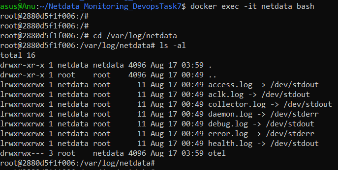

# 📊 Netdata System Monitoring

---

## 📌 Overview

This project demonstrates the deployment of **Netdata**, a lightweight, real-time system and application monitoring tool, containerized with **Docker** and running inside a **WSL2 Ubuntu 24.04** environment.

Netdata provides an intuitive web dashboard at `http://localhost:19999` that offers live visibility into:

* CPU, memory, disk I/O, and network metrics
* Active services and running processes
* Docker container health and resource usage
* System health indicators and performance KPIs

---

## 🛠️ Tech Stack

| Tool/Platform           | Purpose                         |
| ----------------------- | ------------------------------- |
| **Netdata**             | Real-time metrics & monitoring  |
| **Docker**              | Container platform & deployment |
| **WSL2 + Ubuntu 24.04** | Linux environment on Windows    |

---

## ⚙️ How It Works

1. **Docker Image Pull & Run**
   Fetches and runs the latest Netdata container with proper host system access.

2. **Dashboard Access**
   Real-time metrics accessible via browser at `http://localhost:19999`.

3. **Persistent Storage**
   Uses Docker volumes to retain config, cache, and metric data between container restarts.

---

## 🧰 Setup Instructions

### ✅ Run Netdata Container

```bash
docker run -d --name=netdata \
  -p 19999:19999 \
  -v netdataconfig:/etc/netdata \
  -v netdatalib:/var/lib/netdata \
  -v netdatacache:/var/cache/netdata \
  -v /etc/passwd:/host/etc/passwd:ro \
  -v /etc/group:/host/etc/group:ro \
  -v /proc:/host/proc:ro \
  -v /sys:/host/sys:ro \
  -v /etc/os-release:/host/etc/os-release:ro \
  --cap-add SYS_PTRACE \
  --security-opt apparmor=unconfined \
  netdata/netdata
```

> This command will pull the Netdata image if not found locally and launch it with necessary system access.

---

## 🌐 Access the Dashboard

Open your browser and visit:
👉 [http://localhost:19999](http://localhost:19999)

You will see a rich, live-updating dashboard visualizing system and container performance.

---

## 📂 Important Logs & Config Paths

| Location             | Description                                   |
| -------------------- | --------------------------------------------- |
| `/var/log/netdata`   | Netdata logs (mostly linked to stdout/stderr) |
| `/etc/netdata`       | Configuration files                           |
| `/var/lib/netdata`   | Persistent metrics database                   |
| `/var/cache/netdata` | Cache and runtime data                        |

To explore logs inside the container:

```bash
docker exec -it netdata bash
cd /var/log/netdata
ls -l
```

Use logs like `access.log`, `error.log`, and `health.log` for troubleshooting.

---

## 🖼️ Visuals

### Netdata Dashboard Screenshot


### Inside Container: Logs Directory



---

## 🧠 What I Learned

* Deploying observability tools in containerized environments
* Leveraging Docker volumes for persistence of metrics and config data
* Navigating and interpreting real-time monitoring dashboards and logs
* Understanding Netdata’s plugin architecture and health checks
* Differentiating between real-time and long-term monitoring approaches

---

## ✅ Task Checklist

* [x] Netdata Docker container deployed and running
* [x] Live dashboard accessible on port 19999
* [x] Configured persistent Docker volumes
* [x] Logs accessed and verified inside container

---
